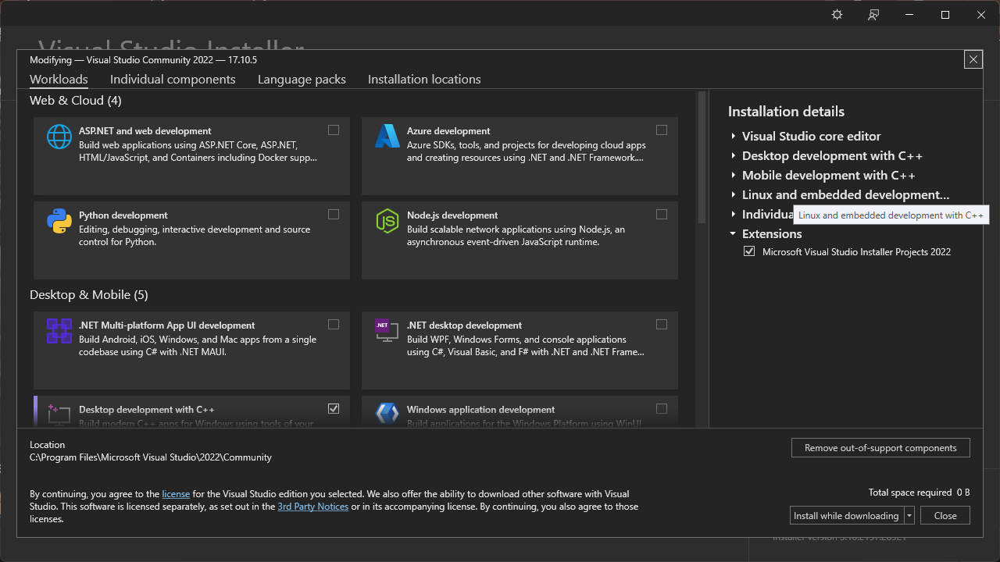

# Initialization of Visual Studio Community 2022
Before we start the c/c++, we must install the Integrated Development Environment (also known as IDE).
There are many kind of IDEs, such as [Visual Studio Community](https://visualstudio.microsoft.com/ko/), [Visual Studio Code](https://code.visualstudio.com/) (VSC), [PyCharm](https://www.jetbrains.com/ko-kr/pycharm/), [Clion](https://www.jetbrains.com/ko-kr/clion/) at Intellij, etc.<br/>
In this post, we try to study C/C++ with Visual Studio Community 2022. Because Visual Studio Community 2022 does not require additional installations, such as MinGW or CMake. 
The essential requirements are all included in the Visual Studio Community 2022.
So it is easy to set up for beginners. 
It also has lots of versions of them, such as 2019, 2017, etc. 
So, if you don't mind Visual Studio Community 2022, you can install another version.
From now on, we start the installation of the Visual Studio Community 2022 and print "Hello world" in the Command Prompt<br/>
### First, visit the Visual Studio website.
If you check [this](https://visualstudio.microsoft.com/ko/), you can visit the Visual Studio website.
But I'm Korean, maybe the website's initial language is Korean.
When you visit the website, we can recognize the **Download Visual Studio** button on the left side.
Then, click the button to download the exe file.<br/>
<br/>
### Second, download and install the file.
If you click the button, the .exe file will be automatically downloaded.
Then, go to the Download folder, check the VisualStudioSetup.exe file.
The popup window will be shown as follows <br/>
<br/>
Click the **Continue**
Then we can see the installation setting<br/>
<br/>
Click the Available and check the Available setup.
In my PC, I have already installed the Visual Studio Community 2022, and we can see only the Visual Studio Community 2022 preview version.
After that, click the **Install**.<br/>
<br/>
In this window, we check the what you want.
In my case, I installed the Desktop development with C++<br/>
<br/>
Additionally, I also make GUI, so i check the **C++ MFC for the latest v143 build tools** and **C++ Modules for v143 build tools**
Then, click the download and install. If you clicked, it takes a few minutes or hours, so take a rest. :)
If you have finished the installation, we can see this window.
### Third, create the project.<br/>
<br/>
We don't have any projects before, therefore, click **Create a new project**
Then we can see lots of options.
Our goal is to show in the "Hello world" in the command prompt. So we find the **Empty Project** in the Create a new project window<br/>
<br/>
Then, create the project name and find the location to save the project; basically, the project will be saved in the **C:\Users\ \{user name}\source\repos**.
In addition, the project name and solution name must be the same.<br/>
<br/>
congratulation!
You created first project with me :)<br/>
<br/>
But this is really empty project, so there are nothing in there.
So, we create the source file for project.
Find the **Source FIles** and click the right button on your mouse.
Then we can see this window.
Click the New items<br/>
<br/>
New popup window wiil be appeared.<br/>
<br/>
But it is unkind window.
So we click the **Show All Templates** on bottom of the left.
Then we can see lots of options as follow.<br/>
<br/>
In this window, we use the **C++ File (.cpp)**<br/>
<br/>
We create the first source file!
### Fourth, Programming what you think.<br/>
<br/>
Finially, we can typing the code in this window.
The source code is followd:
```cpp
#include <stdio.h>

int main(void){
    printf("Hello World\n");
    return 0;
}
```
In here, **#include** means the load the library from the we downloaded before.
**<stdio.h>** means standard input output header file.

Basically, the c/c++ function need return data type and input data type.
int means integer number, void means empty, respectively.
So my function means no input and return integer number.
That's why i written the **return 0;**
Between the int and void have **main**.
It measn function's name.
The c/c++ need main function.
If you don't use main fucntion, the code will be show the error like this.<br/>
<br/>
When you finish typing the code, we can push the key F5 to *debug*.
After the debug, if the code has no errors, we can see the command prompt.<br/>
<br/>
Otherwise, if your code have any error.
You can get the chance to debug or modifed your code like this.<br/>
<br/>
The Visual Studio Community 2022 is so kind.
Therefore, the following errors are shown.
If you recognized these errors, you can easily fix them.<br/>
<br/>
#### Thank you for read my post.


