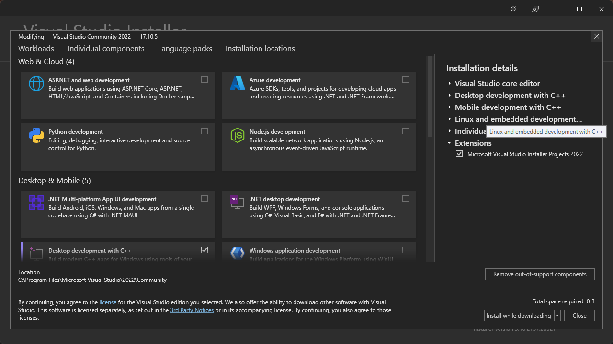

# Initialization of Visual Studio community 2022
Before we start the c/c++, we must be install the Integrated Development Enviroment(as known as IDE).
There are many kind of IDE, such as [visual studio community](https://visualstudio.microsoft.com/ko/), [visual studio code](https://code.visualstudio.com/) (VSC), [PyCharm](https://www.jetbrains.com/ko-kr/pycharm/), [Clion](https://www.jetbrains.com/ko-kr/clion/) at Intellij, etc.<br/>
In this post, we try to study C/C++ with visual studio community 2022. Because the visual studio community 2022 is not require the extra install such as mingw, cmake. 
The essential requriements are all included in the visual studio community 2022.
So it is easy to setup for the beginners. 
It also has lots of version of them, such as 2019, 2017, etc. 
So if you don't mind visual studio community 2022, you can install another version.
From now, we start the install of the visual studio community 2022 and print "Hello world" in Command Prompt<br/>
### First, visit the Visual Studio website.
If you check the [this](https://visualstudio.microsoft.com/ko/) you can visit the Visual Studio website.
But i'm Korean, Maybe the website inital language is Korean.
When you visit the website, we can recongized the **Download Visual Studio** button on the left side.
Then, click the button for download exe file.<br/>
<br/>
### Second, Download and install the file.
If you click the button, exe file will be automatically downloaded.
Then, go to the Download folder, check the VisualStudioSetup.exe file.
The popup window will be shown as follow<br/>
<br/>
Click the **Continue**
Then we can see the installation setting<br/>
<br/>
Click the Available and check the Available setup.
In my PC, already install the visual studio community 2022, we can see only visual studio community 2022 preview version.
After then, click the **Install**.

In this window, we check the what you want.
In my case, i installed the Desktop development with C++

Additionally, i also make GUI, so i check the **C++ MFC for latest v143 build tools** and **C++ Modules for v143 build tools**
Then, click the download and install. If you clicked, it takes Few minutes or hours, so take rest. :)
If you finished installation, we can see the this window.
### Third, Create the project.

We don't have the any project before, therefore click the **Create a new project**
Then we can see lots of options.
Our goal is show in the "Hello world" in command prompt. So we find the **Empty Project** in Create a new prject window

Then, create the project name and find location of the save project, basically the project will be saved in the **C:\Users\{user name}\source\repos**.
In addtion, the project name and solution name must be same.

congratulation!
You created first project with me :)

But this is really empty project, so there are nothing in there.
So, we create the source file for project.
Find the **Source FIles** and click the right button on your mouse.
Then we can see this window.
Click the New items

New popup window wiil be appeared.

But it is unkind window.
So we click the **Show All Templates** on bottom of the left.
Then we can see lots of options as follow.

In this window, we use the **C++ File (.cpp)**

We create the first source file!
### Fourth, Programming what you think.

Finially, we can typing the code in this window.
The source code is followd:
```cpp
#include <stdio.h>

int main(void){
    printf("Hello World\n");
    return 0;
}
```
In here, **#include** means the load the library from the we downloaded before.
**<stdio.h>** means standard input output header file.

Basically, the c/c++ function need return data type and input data type.
int means integer number, void means empty, respectively.
So my function means no input and return integer number.
That's why i written the **return 0;**
Between the int and void have **main**.
It measn function's name.
The c/c++ need main function.
If you don't use main fucntion, the code will be show the error like this.

When you finished the typing the code, we can push the key **F5** for *debug*.
After the debug, if code has not any error, we can see the command prompt.

Otherwise, if your code have any error.
You can get the chance to debug or modifed your code like this.

The visual studio community 2022 is so kind.
Therefore, the shown the errors as follow.
If you recongized these errors, you can easily fix the errors.

#### Thank you for read my post.


